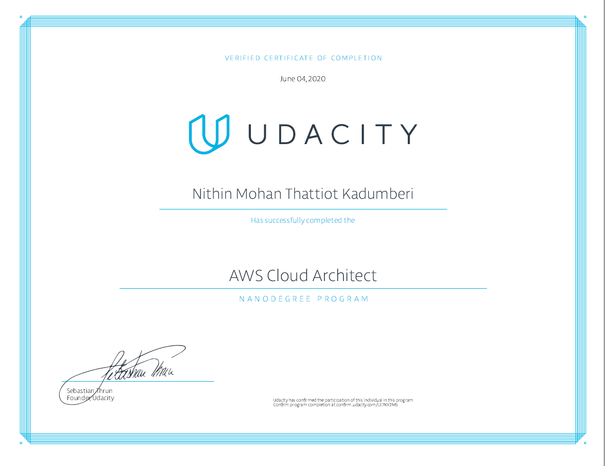

## Introduction 
This repository contains my practical project works for **Udacity AWS Cloud Architect Nanodegree program**.  As part of working from home due to **COVID-19**, I decided to utilize my free time and do something to upskill myself with help of available free resources. With such interest I started with _[Udacity AWS Cloud Architect Nano Degree](https://www.udacity.com/course/aws-cloud-architect-nanodegree--nd063)_

## Project Status
** COMPLETED - June'04 2020 **

## Getting Started

### Folder Structure 
* **exercises** - contains sample works as part of the labs from the chapters.
* **project**  - contains actual project work submitted as part of the assignments for the curriculam.
- [01-recoverability-in-aws](projects/01-recoverability-in-aws)
- [02-performance-and-scalability-in-aws](projects/02-performance-and-scalability-in-aws)
- [03-design-for-security](projects/03-design-for-security)

## Installation 
 
 You need the following components for running the exercises:
 1. AWS CLI
 2. Terraform CLI
 3. Visual Studio Code 

### AWS CLI
- Install [AWS CLI for Windows](https://awscli.amazonaws.com/AWSCLIV2.msi) | [Other Platforms](https://aws.amazon.com/cli/).
- [Installing the CLI](https://docs.aws.amazon.com/cli/latest/userguide/install-cliv2.html)
- [Configuring the CLI](https://docs.aws.amazon.com/cli/latest/userguide/cli-chap-configure.html)

### Install Terraform CLI
- Install [Terraform CLI](https://learn.hashicorp.com/terraform/getting-started/install)

### Install Visual Studio Code IDE
You can use any code editor or IDE that supports client-side development to build your web part, such as:
- [Visual Studio Code](https://code.visualstudio.com/)  * I used Code

## Useful Terraform Commands 

```terrafrom init```

```terraform plan```

```terraform apply```

```terraform destroy```

```terraform destroy --target={instanceId_here}```

```terraform show```

```terraform state list```

Command to test the validity of your configuration:
```terraform validate```

Terraform will attempt when it comes to provision the infrastructure according to your configuration:
```terraform plan -var-file="definitions.tfvars"```

Execute the plan by running terraform apply:
```terraform apply -var-file="definitions.tfvars"```

## Usage 
You can use the source code in repository under MIT License without any warranty or support. Free to use, without any royalty.

## Completion Certificate


### License 
MIT License © 2020
