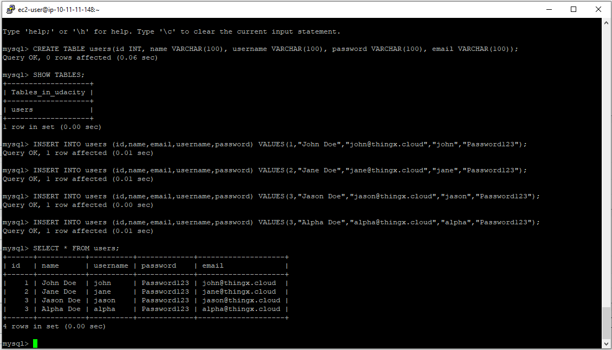

## Screenshot for PROJECT-1

### Primary VPC

### Secondary VPC

### Primary/Master RDS 

#### (primaryDB_config.PNG)

#### (primaryDB_subnetgroup.PNG)

#### primary_subnet_routing.PNG

### Secondary/Replica RDS 

#### (secondaryDB_config.PNG)

#### (secondaryDB_subnetgroup.PNG)

#### secondary_subnet_routing.PNG

### RDS Monitoring

#### monitoring_connections.PNG

#### monitoring_replication.PNG

### EC2 & Connectivity Testing

primary_EC2_config.PNG

#### rr_after_promotion.PNG

#### rr_before_promotion.PNG
![rr_before_promotion.PNG(rr_before_promotion.PNG)

### S3

#### (s3_original.PNG)

#### (s3_season.PNG)

#### (s3_versions.PNG)

#### (s3_season_revert.PNG)

#### (s3_deletion.PNG)

#### (s3_deletion_marker.PNG)

#### (s3_delete_revert.PNG)
